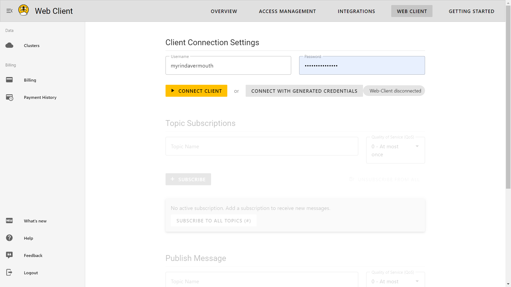

# Project Name: IoT water quality monitoring system
An IoT water quality monitoring system is a full-stack web application that allows users to monitor and analyze the quality of water in the building's plumbing system..

## Table of Contents
- [Description](#description)
- [Technologies](#technologies)
- [Features](#features)
- [Getting Started](#getting-started)
- [Installation](#installation)
- [Usage](#usage)

## Description
<!-- BookStore is a web application that allows users to browse and purchase books from a collection of books. Users can create an account, search for sensor, add them to their cart, and make a purchase. The application also includes a dashboard for the admin user to manage the books, orders, and customers. -->

An IoT water quality monitoring system is a type of Internet of Things (IoT) solution that enables real-time monitoring of the quality of water. It typically consists of sensors, data collection devices, and cloud-based analytics platforms.

The system collects data on various water quality parameters, such as pH, temperature, dissolved oxygen, conductivity, turbidity, and chemical composition. The data is transmitted wirelessly to a cloud-based platform, where it can be analyzed and processed.

The system can be installed in various settings, such as drinking water distribution networks, industrial water treatment plants, aquaculture farms, and swimming pools. It can also be used in monitoring the water quality in rivers, lakes, and other bodies of water.

## Technologies
The system is built using the following technologies:

- React.js
- Node.js
- Express.js
- MySql + Sequelize cli
- MQTT

## Features
- User authentication and authorization
- Admin dashboard for managing sensors
<!-- - Admin dashboard for managing books, orders, and customers -->
<!-- - Book search and filtering -->
<!-- - Shopping cart and checkout process -->

## Getting Started
To get started with An IoT water quality monitoring system, you will need to install Node.js and MySql on your machine. You can download them from the following links:

- [Node.js](#Node.js)
- [MySql](#MongoDB)
- [HiveMq](https://console.hivemq.cloud/)
  - Connect HiveMQ Cluster

Once you have installed the required dependencies, you can follow the installation and usage instructions below.
## Installation
To install An IoT water quality monitoring system, follow these steps:

1. Clone the repository: `git clone https://github.com/Maj64/IoT_final_projects.git`
2. Navigate to the client directory: `cd IoT_final_projects/client`
3. Install the dependencies: `npm install`
4. Navigate to the server directory: `cd ../server`
5. Install the dependencies: `npm install`

## Usage
To use app, follow these steps:

1. Start the server: `cd server && npm start`
2. Start the client: `cd ../client && npm start`
3. Open the application in your browser: [http://localhost:3000](http://localhost:3000)

