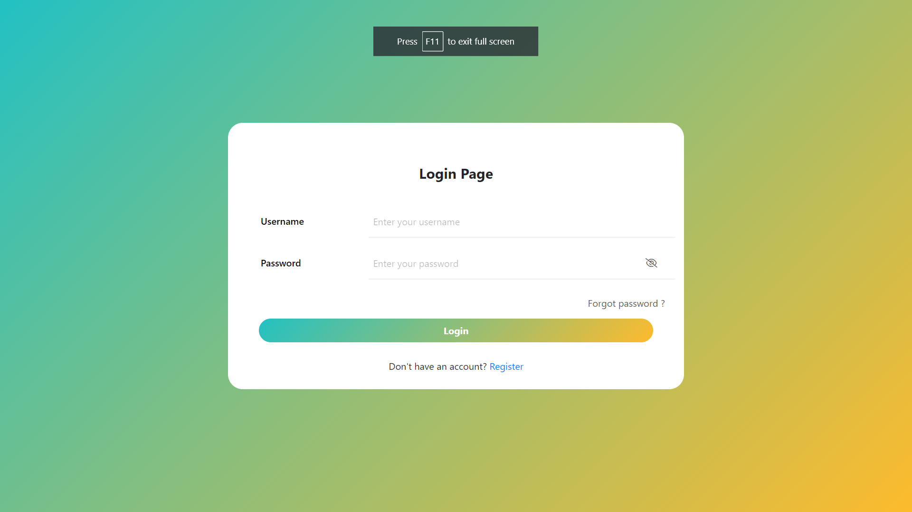
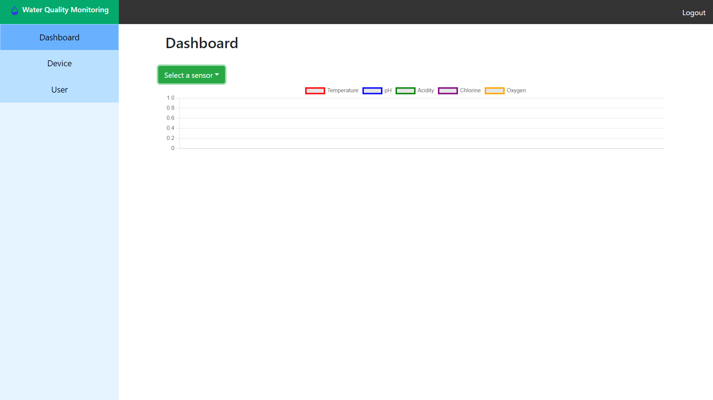
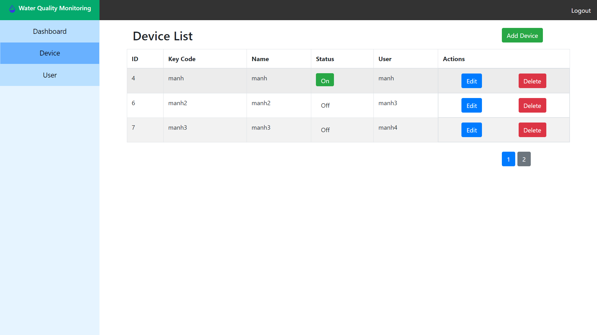

# MultiSig Wallet

## Introduction 
multisig-wallet is a production-ready front-end solution for wallet interfaces. It is based on [react](https://github.com/facebook/react) and uses the UI Toolkit [create-react-app](https://github.com/facebook/create-react-app).


## Preparation

You need to install [node](https://nodejs.org/) and [git](https://git-scm.com/) locally. The project is based on [ES2015+](https://es6.ruanyifeng.com/), [vue](https://github.com/facebook/react), [redux](https://github.com/reduxjs/redux), [react-router](https://github.com/remix-run/react-router), [axios](https://github.com/axios/axios) and [react-bootstrap](https://github.com/react-bootstrap/react-bootstrap),...
Understanding and learning this knowledge in advance will greatly help the use of this project.

## Getting started

```bash
# install dependency
npm install

# develop
npm run dev
```
This will automatically open http://localhost:3000

## Demo

### Wallet page

### Home page of wallet 

### Transaction page of wallet
